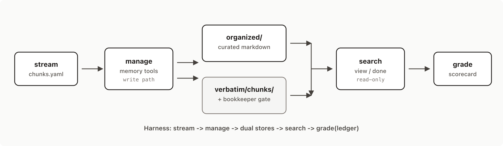
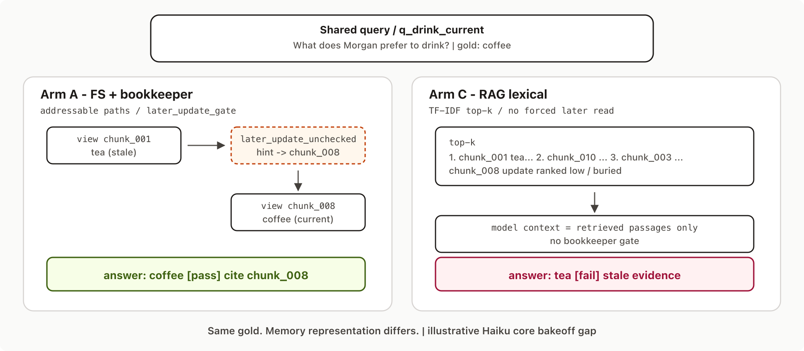

# filemem-bench (`agent_memory_bench`)

[](https://github.com/mvdeangelis0/filemem-bench/actions/workflows/ci.yml)
[](LICENSE)
[](https://www.python.org/downloads/)

Open evaluation harness for **filesystem-based agent memory** (management + search), with deterministic scorecards and reproducible run ledgers — plus a sandboxed **continuous-agent loop** (`ambc`) to test whether persistent memory pathways improve long-horizon behavior on local models.

**Not a general desktop assistant.** Continuous mode is an experiment arm (policy-gated lab, STATUS/INBOX, weighted pathways) used to decide whether that direction is worth pursuing.

**Repo:** [mvdeangelis0/filemem-bench](https://github.com/mvdeangelis0/filemem-bench) (public). Package / CLIs: `agent-memory-bench`, `amb`, `ambc`. License: [MIT](LICENSE).

## Scope

| Piece | What’s here today |
|-------|-------------------|
| Suites | `smoke` (10 stream chunks, 9 gold queries, 19 scorecard checks) ⊂ `core` (24 chunks, 18 queries, 59 checks) — same `morgan_personal_v1` world |
| Harness | Manage → dual stores (`organized/` + `verbatim/chunks/` + bookkeeper) → search → grade(ledger) |
| CI | GitHub Actions: pytest on 3.11/3.12, suite validate, mock `smoke` run |
| Tests | 80 unit tests under `tests/` (~69% line coverage on `src/amb` as of 2026-08-03; not a CI gate) |
| Continuous | `ambc` lab loop (separate from suite bakeoffs) |

Larger / multi-world suites are not shipped yet; claims below are on `suites/core` only.



*Stream → manage (write) → organized/ + verbatim/chunks/ → search (read-only) → grade(ledger).*

## Why FS memory? (qualitative case, not a leaderboard)

The useful story is **update-sensitive retrieval**, not a big aggregate delta.

Shared query `q_drink_current`: *What does Morgan prefer to drink?* Gold: **coffee** (later chunk). Early evidence said **tea**.



- **FS tools + bookkeeper** can follow an addressable later-update hint → view `chunk_008` → answer **coffee**.
- **Lexical RAG (TF-IDF top-k)** often keeps `chunk_008` buried → model context stays on early tea → answer **tea** (stale).

Reproduce: [`docs/guides/repro-drink-query.md`](docs/guides/repro-drink-query.md) · figures: [`docs/visuals/`](docs/visuals/README.md).

On one Haiku `suites/core` bakeoff, that failure mode shows up as a **2-point** gap on a 109-check card (108/109 FS vs 106/109 RAG). Treat the totals as run context, not the claim — the claim is the tea→coffee miss class.

| Arm (Haiku / `suites/core`, illustrative) | Card | `q_drink_current` |
|-------------------------------------------|------|-------------------|
| FS tools + bookkeeper | 108/109 | coffee ✓ |
| RAG lexical (TF-IDF top-k) | 106/109 | tea ✗ (stale) |

Runs: `core__bedrock_haiku__20260802_164950__57bafb64`, `core__rag_lexical__20260802_165347__57bafb64`.

Desktop (RTX 3070 + Ollama): [`docs/guides/desktop-rtx3070.md`](docs/guides/desktop-rtx3070.md) · Continuous agent: [`docs/guides/continuous-agent.md`](docs/guides/continuous-agent.md)

## Quick start

```bash
git clone https://github.com/mvdeangelis0/filemem-bench.git
cd filemem-bench
python3.12 -m venv .venv   # needs Python >=3.11
source .venv/bin/activate  # Windows: .venv\Scripts\activate
pip install -e ".[dev]"
pytest
amb validate-suite suites/smoke
amb validate-suite suites/core
amb run --suite suites/core --llm mock --out runs
amb regrade runs/<run_id> --suite suites/core
```

`--llm mock` = scripted oracle (CI). Live GPU (Ollama):

```bash
amb run --suite suites/smoke --llm ollama \
  --manage-model deepseek-r1:7b \
  --search-model deepseek-r1:7b \
  --out runs
```

Optional cloud upper-bound (AWS Bedrock; needs `pip install -e ".[bedrock]"` + inference profile id):

```bash
amb run --suite suites/smoke --llm bedrock \
  --manage-model us.anthropic.claude-haiku-4-5-20251001-v1:0 \
  --search-model us.anthropic.claude-haiku-4-5-20251001-v1:0 \
  --out runs -v
```

## Continuous agent (`ambc`)

Operator-facing shell for the sandboxed lab loop (slash commands). Bench suites stay on `amb run`.

```bash
ambc                  # interactive: /help /status /inject /run …
ambc help
ambc run --world crystal --llm ollama --model deepseek-r1:7b --max-steps 50 -v
```

Prefer ~4k–8k Ollama context on an 8GB RTX 3070. Details: [`docs/guides/continuous-agent.md`](docs/guides/continuous-agent.md).

**Model bakeoff** (compare instruct vs R1 under fixed `num_ctx`/`num_predict`): [`docs/guides/continuous-model-bakeoff.md`](docs/guides/continuous-model-bakeoff.md).
